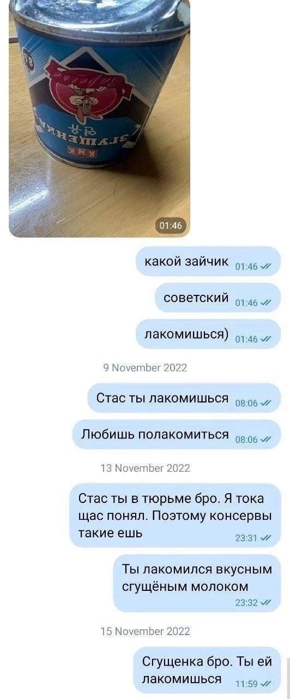

Лабораторная Работа №1.

ФИО: Якуба Антон Андреевич.
Группа: 6404-010302D.
Научный Руководитель: Гоголева С.Ю.
Тема ВКР: Поиск Алгоритма Подбора Параметра Регуляризации Для Плохо Обусловленных Задач С Помощью Нейронных Сетей.

Любимая Цитата: "Новые ЭмСи Лучше Тех, Что На Пенсии" - Yung Trappa.

Картинка, Которая Мне Нравится.